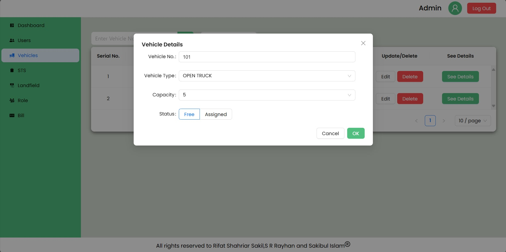
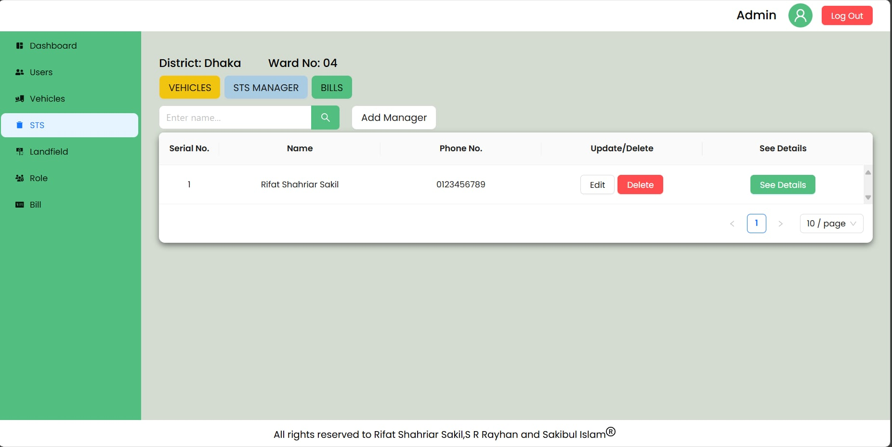

# EcoSync

EcoSync is a full-stack application built with React.js, Express.js, and MongoDB. This project handles waste collection and management for Dhaka North City Corporation.

This is an ongoing project that will have role based authentication and management for proper waster transition
## Project Structure

The project is divided into two main directories:

- ```/frontend``` - Contains the React.js frontend application.
- ```/backend``` - Contains the Express.js backend server, which uses MongoDB as the database.

Some screens are given below:







